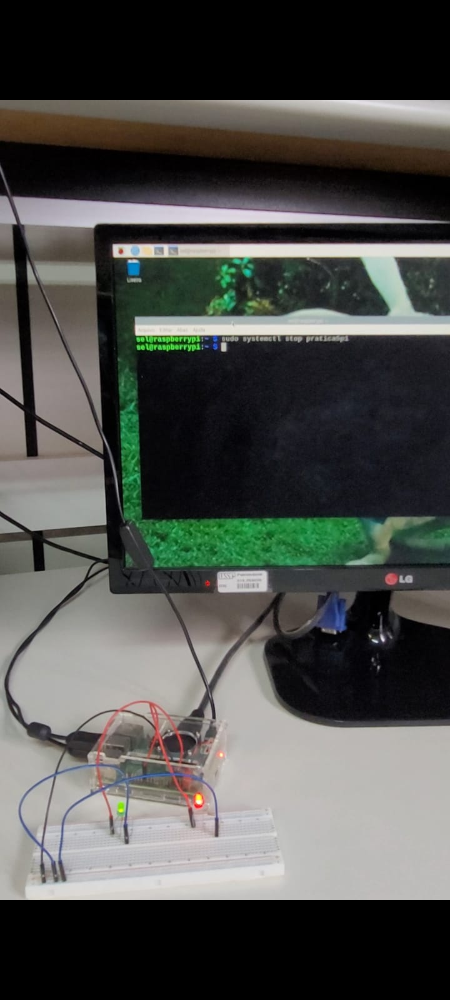

**Autor:** Pedro Pontes - 13864627
           Ruan Victor - 14691533

# Projeto: Blink Service com Systemd

Este projeto implementa um serviço no Linux da Raspberry Pi que controla o acionamento de LED. O objetivo é demonstrar o gerenciamento de processos via `systemd`.

## Descrição do Funcionamento

O serviço opera em dois modos:
1.  **Start (Execução):** Ao ligar a resp inicia o script `blink2.py`, que faz um LED (GPIO 18) piscar com intervalo de 6s ligado e 0.5s desligado.
2.  **Stop (Parada):** Ao interromper o serviço, o `systemd` executa o script `contador.py`. Este realiza uma contagem regressiva de 10 segundos no terminal e, ao finalizar, acende um segundo LED (GPIO 12) indicando o fim do processo.

##  Arquivos

Caminho do projeto: `/home/sel/PedroRuan/`

* **`pratica5p1.service`**: Arquivo de configuração da unidade systemd. Define os comandos `ExecStart` e `ExecStop`. Existe uma copia desse arquivo na pasta `/lib/systemd/sytem/` para funcionar como serviço
* **`p5p1.sh`**: Script Shell que chama o python para o blink.
* **`blink2.py`**: Lógica do LED piscando em LOOP.
* **`contador.sh`**: Script Shell que chama o python para o contador.
* **`contador.py`**: Lógica da contagem regressiva.

## Comandos usados

1.  **Permissões:**
    ```bash
    chmod +x /home/sel/PedroRuan/nome.sh
    ```

3.  **Comandos de Controle:**

    sudo  systemctl enable pratica5p1.service para habilitar o serviço

    sudo systemctl stop pratica51.service para desabiltar

    

##  Hardware (Pinout)

* **GPIO 18:** LED de Pisca (Blink)
* **GPIO 12:** LED de Status (Finalização)

---
## IMAGENS DO FUNCIONAMENTO

### Inicialização

* 

### Parando (stop)

* 
